# Slack Analytics Bot — Finalized Workflow and Implementation Plan

> **Status:** Final workflow for team review before development  
> **Purpose:** Slack-based natural-language interface for fetching Instagram, Facebook, and LinkedIn analytics through BrightBean  
> **Architecture:** Slack interaction layer → LLM interpretation layer → BrightBean analytics layer  
> **Scope:** Simple, focused, read-only analytics assistant  
> **Primary LLM:** Claude  
> **Fallback LLM:** GLM through Z.AI API

---

## 1. Overview

We are building a Slack bot that allows authorized users to ask natural-language questions about social media analytics.

The bot will support analytics for:

- Instagram
- Facebook
- LinkedIn

BrightBean will remain the analytics and data-retrieval system. The Slack bot will not query the database directly and will not implement duplicate analytics logic.

The LLM layer will sit between Slack and BrightBean. Its responsibility is to:

1. Understand the user's question.
2. Identify the requested platform, metric, and time range.
3. Select an approved BrightBean analytics tool.
4. Interpret the structured data returned by BrightBean.
5. Generate a concise natural-language answer for Slack.

The bot will primarily respond when:

1. A user mentions the bot in an approved Slack channel.
2. A user replies inside an active thread where the bot has already responded.

---

## 2. Primary Objective

The bot should provide a simple interaction such as:

```text
User:
@AnalyticsBot What was our top Instagram post this week?

Bot:
Your top Instagram post this week was "Summer Sale Launch".

Engagements: 1,248
Reach: 18,942
Engagement rate: 5.2%

Data last synced 2 hours ago.
```

Follow-up questions should work inside the same thread:

```text
User:
What about Facebook?

Bot:
Your top Facebook post this week was ...
```

---

## 3. Goals and Non-Goals

### 3.1 Goals

- Allow users to ask analytics questions in Slack.
- Support Instagram, Facebook, and LinkedIn only.
- Respond only when mentioned or when a valid bot thread receives a follow-up.
- Acknowledge Slack requests immediately.
- Process analytics questions asynchronously.
- Use Claude as the primary LLM.
- Use GLM through Z.AI as fallback for transient Claude failures.
- Use BrightBean as the only analytics-fetching layer.
- Keep all analytics tools read-only.
- Enforce user and workspace authorization before analytics access.
- Return concise Slack-friendly answers.
- Include the requested time period and data freshness in responses.
- Prevent duplicate responses when Slack retries an event.

### 3.2 Non-Goals for the Initial Release

The following are excluded from the initial implementation:

- Slash command such as `/analytics`
- Direct messages
- Private-channel support
- CSV or JSON exports
- Interactive buttons and pagination
- Local Ollama or self-hosted LLMs
- Multi-Slack-workspace onboarding
- Recommendation engine
- Publishing, deleting, reconnecting, or modifying social accounts
- Arbitrary SQL generation
- Full response caching
- Advanced dashboards and metrics infrastructure

---

## 4. Finalized Architecture

```mermaid
flowchart LR
    U[Slack User] -->|Mention bot or reply in active bot thread| S[Slack Events API]

    S --> H[Slack Event Handler]

    H --> V[Verify Signature and Timestamp]
    V --> I[Ignore Bot and Unsupported Events]
    I --> D[Deduplicate by event_id]
    D --> P[Store Minimal Event Metadata]
    P --> A[Return HTTP 200 Immediately]

    P --> Q[Background Task]
    Q --> N[Normalize Message]
    N --> C[Resolve Slack User Channel and Thread]
    C --> Z[Authorize BrightBean Access]

    Z --> R{Simple Command?}

    R -->|hello help status| X[Direct Response]
    R -->|Analytics Question| L[LLM Layer]

    L --> CL[Claude Primary]
    CL -->|Transient Failure| GLM[GLM via Z.AI]

    L --> T[Approved Analytics Tool]
    T --> B[BrightBean Analytics Services]
    B --> T
    T --> L

    X --> F[Slack Response Formatter]
    L --> F

    F --> Y[Post Response to Original Channel or Thread]
```



---

## 5. End-to-End Workflow

```text
1. User mentions the bot
   OR replies inside an active bot thread

2. Slack sends an event to BrightBean

3. Slack event handler:
   - verifies Slack signature
   - verifies request timestamp
   - ignores bot messages and unsupported event types
   - checks event_id for duplicates
   - stores minimal event metadata
   - returns HTTP 200 immediately

4. Background task starts

5. Message is normalized:
   - bot mention removed
   - whitespace cleaned
   - user, channel, thread, and text extracted

6. Access context is resolved:
   - Slack channel mapped to BrightBean workspace
   - Slack user checked for access
   - allowed Instagram, Facebook, and LinkedIn accounts determined

7. Deterministic routing:
   - hello/help/status handled directly
   - analytics questions sent to LLM

8. LLM interprets the request:
   - Claude primary
   - GLM fallback on timeout, 429, network failure, or provider 5xx
   - identifies platform, metric, and time range
   - selects an approved BrightBean tool

9. BrightBean tool fetches analytics:
   - read-only data access
   - returns structured data
   - includes period and freshness metadata

10. LLM interprets the tool result:
    - summarizes findings
    - avoids unsupported claims
    - produces a structured answer

11. Slack formatter converts the structured answer into Slack-compatible output

12. Bot replies in the original channel or thread

13. Processing result is logged with a correlation ID
```

---

## 6. Separation of Responsibilities

### 6.1 Slack — User Interaction Layer

Slack is responsible for:

- receiving user messages
- sending bot mentions and thread replies
- delivering events to BrightBean
- displaying the final answer
- maintaining channel and thread context

Slack is not responsible for:

- interpreting analytics questions
- selecting analytics tools
- accessing BrightBean data
- enforcing BrightBean permissions
- calculating metrics

### 6.2 LLM — Understanding and Response Layer

The LLM is responsible for:

- understanding the user request
- identifying platform, metric, time range, and comparison request
- deciding which approved analytics tool to call
- interpreting structured BrightBean results
- producing concise natural-language answers
- asking clarification when the request is ambiguous

The LLM is not responsible for:

- database access
- SQL generation
- selecting workspace or tenant
- overriding permissions
- modifying BrightBean data
- exposing prompts, tokens, or internal identifiers
- inventing analytics not returned by BrightBean

### 6.3 BrightBean — Analytics and Data Layer

BrightBean is responsible for:

- enforcing access scope
- mapping users and channels to the correct workspace
- exposing approved read-only analytics services
- defining metric calculations
- querying analytics data
- returning structured results
- returning data freshness information
- reporting missing or unavailable data

BrightBean is not responsible for:

- Slack-specific formatting
- natural-language interpretation
- LLM prompt handling
- user conversation management beyond the required thread context

---

## 7. Slack Trigger Rules

### 7.1 Required Triggers

| Trigger | MVP | Post-MVP | Behaviour |
|---|---:|---:|---|
| `app_mention` | Yes | — | User mentions the bot in an approved channel. |
| Reply in active bot thread | No | Yes | User sends a follow-up in a thread where the bot has already responded. Requires `message.channels` subscription (see below). |
| Slash command | No | Optional | Excluded from the initial implementation. |
| Direct message | No | Optional | Excluded unless explicitly approved later. |
| Private channel | No | Optional | Excluded unless explicitly approved later. |

### `message.channels` Privacy and Retention Policy

Detecting non-mention thread follow-ups requires subscribing to `message.channels`,
which means Slack sends **every message event** from channels where the bot is
present — even messages the bot ultimately ignores.

For the MVP, the bot uses `app_mention` only. Users mention the bot for each
question, including follow-ups. This avoids the privacy implications of
`message.channels` entirely.

When thread follow-ups are enabled post-MVP:

- Obtain team lead and privacy approval before enabling `message.channels`.
- Restrict the bot to explicitly approved channels only.
- Inspect trigger metadata **before** storing the full message body.
- Immediately discard messages that are not direct mentions or valid
  active-bot-thread replies.
- Do not persist or log the text of ignored messages.
- Retain only minimal audit metadata (event ID, channel ID, timestamp,
  `IGNORED` status) for ignored messages.
- Keep private channels and DMs disabled unless separately approved.

### 7.2 Event Handling Rules

The bot must ignore:

- messages sent by bots
- messages sent by itself
- message edits
- message deletions
- unsupported Slack event subtypes
- ordinary messages that are not mentions or active-thread replies
- messages outside approved channels

---

## 8. Slack Event Handler

The Slack event handler must remain lightweight.

### Responsibilities

1. Read the raw request body.
2. Verify the Slack signing secret.
3. Verify the timestamp against the replay window.
4. Handle Slack URL verification.
5. Parse the event envelope.
6. Ignore unsupported events.
7. Deduplicate using `event_id`.
8. Save minimal event metadata.
9. Enqueue the event for background processing.
10. Return HTTP 200 immediately.

### Pre-Acknowledgement Rule

The following must not run before Slack acknowledgement:

- Claude request
- GLM request
- BrightBean analytics query
- response formatting
- Slack response generation

---

## 9. Minimal Event Persistence

A small event model is sufficient.

### Suggested Model: `SlackInboundEvent`

| Field | Purpose |
|---|---|
| `id` | Internal primary key |
| `correlation_id` | End-to-end trace identifier |
| `event_id` | Unique Slack event identifier |
| `team_id` | Slack workspace identifier |
| `channel_id` | Slack channel identifier |
| `user_id` | Slack user identifier |
| `thread_ts` | Slack thread identifier, nullable |
| `event_ts` | Slack event timestamp |
| `message_text` | Normalized or minimally stored user text |
| `status` | `RECEIVED`, `PROCESSING`, `RESPONDED`, `FAILED`, `IGNORED` |
| `response_ts` | Slack response timestamp, nullable |
| `created_at` | Created time |
| `updated_at` | Updated time |

### Retention Rules

- Do not store tokens or secrets.
- Do not store unrestricted analytics payloads.
- Retain only the conversation data required for follow-up questions.
- Apply a defined retention period to user messages and event records.

---

## 10. Background Processing

Slack analytics requests must run in a background task.

### Background Task Responsibilities

- claim the event
- prevent duplicate concurrent processing
- normalize the message
- resolve user and workspace context
- verify access
- call the deterministic router or LLM
- call BrightBean analytics tools
- format and send the Slack response
- update the event status

### Worker Strategy

For the initial release:

- use BrightBean's existing background-task system
- identify Slack tasks separately
- measure queue wait time and publishing impact

Create a dedicated Slack worker only if testing shows that Slack traffic delays existing BrightBean jobs.

---

## 11. Message Normalization

### Minimal Normalized Request

```python
SlackAnalyticsRequest(
    correlation_id=...,
    event_id=...,
    team_id=...,
    channel_id=...,
    user_id=...,
    thread_ts=...,
    text=...,
)
```

### Normalization Tasks

- remove bot mention
- trim duplicate whitespace
- preserve important numbers and platform names
- identify thread context
- reject empty or punctuation-only questions
- generate or attach correlation ID

---

## 12. Access Resolution and Authorization

Before the LLM is called, the application must determine:

1. Which BrightBean workspace is linked to the Slack channel.
2. Which BrightBean user or role is linked to the Slack user.
3. Whether the user may view analytics.
4. Which Instagram, Facebook, and LinkedIn accounts are allowed.

### Required Security Rule

The LLM must never provide or override:

- organization ID
- workspace ID
- user ID
- account allowlist

The application must create the authorization context.

### Example

```python
ToolContext(
    workspace_id=authorized_workspace_id,
    user_id=authorized_user_id,
    allowed_account_ids=authorized_account_ids,
)
```

Every BrightBean analytics call must use this context.

---

## 13. Deterministic Command Router

A small deterministic router should handle simple requests without calling the LLM.

| Input | Response |
|---|---|
| `hi`, `hello`, `hey` | Short welcome message |
| `help`, `what can you do` | Supported examples |
| `status`, `connected accounts` | List authorized connected accounts |
| blank or punctuation-only input | Ask the user for a specific analytics question |
| everything else | Send to LLM |

This router must remain small and should not become a second natural-language intent engine.

---

## 14. LLM Layer

### 14.1 Provider Order

1. Claude
2. GLM through Z.AI

### 14.2 Fallback Conditions

Fallback to GLM only when Claude fails because of:

- timeout
- network failure
- HTTP 429
- provider HTTP 5xx
- temporary provider unavailability

Do not use fallback for:

- authorization failure
- invalid user request
- no analytics data
- unsupported platform
- low-quality but valid response
- prompt design issues

### 14.3 Minimal Provider Interface

```python
class LLMProvider:
    def process(
        self,
        request,
        tools,
        conversation_context,
    ) -> LLMResult:
        ...
```

Provider-specific Claude and Z.AI formats must remain inside their own adapters.

### 14.4 Tool Call Rules

- approved tool allowlist only
- validate tool arguments
- reject unknown tools
- maximum tool-call rounds
- bounded total execution time
- preserve successful BrightBean results if Claude fails during final response generation

---

## 15. Supported Analytics Tools

Only Instagram, Facebook, and LinkedIn are supported.

| Tool | Parameters | Purpose |
|---|---|---|
| `list_connected_accounts` | none | List authorized connected accounts |
| `get_account_stats` | `platform`, `days` | Account-level analytics |
| `get_top_posts` | `platform`, `metric`, `limit`, `days` | Return top-performing posts |
| `get_post_detail` | `post_id` | Return analytics for one post |
| `compare_platforms` | `platforms`, `metric`, `days` | Compare platforms |
| `get_follower_growth` | `platform`, `days` | Follower growth trend |
| `get_engagement_summary` | `platform`, `days` | Engagement breakdown |

### Tool Requirements

Every tool must be:

- read-only
- permission-scoped
- schema-validated
- bounded by date range and result count
- deterministic
- testable independently
- freshness-aware

### Unsupported Platforms

If the user asks about another platform:

```text
This bot currently supports Instagram, Facebook, and LinkedIn analytics.
```

---

## 16. Metric Definitions

BrightBean must define metrics deterministically.

| Term | Definition |
|---|---|
| Engagements | Sum of supported reactions, comments, shares, and saves |
| Engagement rate | BrightBean-defined engagement formula |
| Top post | Highest value for the requested metric in the selected period |
| Follower growth | Difference or trend in follower count during the selected period |
| Reach | Platform-native reach metric |
| Impressions | Platform-native impressions metric |
| Views | Platform-native view metric |

The LLM must not create its own metric definitions.

### Default Time Range

When the user does not provide a time range:

```text
Default: last 30 days
```

The final response must state the period used.

---

## 17. Account Selection Rules

A platform may contain more than one connected account.

```text
One matching account
→ use it

Multiple matching accounts
→ ask the user to choose

No matching account
→ state that the platform is not connected
```

The LLM must not guess which account the user intended.

---

## 18. BrightBean Tool Response Contract

BrightBean should return structured data.

```json
{
  "status": "ok",
  "platform": "instagram",
  "period": {
    "from": "2026-06-10",
    "to": "2026-07-10"
  },
  "data_as_of": "2026-07-10T09:15:00+05:00",
  "last_synced_at": "2026-07-10T08:45:00+05:00",
  "is_stale": false,
  "metrics": {
    "reach": 18420,
    "engagements": 2310,
    "engagement_rate": 4.8
  }
}
```

### Required Fields

- status
- platform
- selected account
- period
- result data
- `data_as_of`
- `last_synced_at`
- `is_stale`
- machine-readable error code where applicable

---

## 19. Conversation Context

Follow-up questions should work inside the same Slack thread. This is a
post-MVP feature (requires `message.channels` — see Section 7.1).

For the MVP, each question is independent. The user mentions the bot for
every question. Thread context is stored but not automatically triggered.

### Required Context Key

```text
team_id + channel_id + thread_ts
```

Do not store context by channel alone.

### Minimal Context

For the initial release, retain:

- previous user question
- previous bot answer
- selected platform
- selected account
- selected period
- last tool result summary
- expiry timestamp

This is enough for questions such as:

```text
What about Facebook?
Show the same for last month.
```

A full conversation summarization subsystem is not required initially.

---

## 20. Structured LLM Response

The LLM should return a structured internal answer, not raw Slack Block Kit JSON.

### Data-Integrity Rule: Numbers From Tools Only

All analytics numbers displayed in Slack must come directly from tool results,
never from LLM-generated values. The responsibilities are separated as follows:

| Layer | Owns |
|---|---|
| **Tool layer** | Metric values, rankings, percentages, deltas, date ranges, sample sizes, freshness timestamps |
| **LLM** | Intent interpretation, tool selection, qualitative explanation, caveats, clarifying questions |
| **Formatter** | Inserting exact tool values into the display, number formatting, tables, Block Kit generation |

The LLM references tool-result fields by name. The formatter resolves those
references to the actual values. The LLM never types a number.

```json
{
  "summary": "Instagram had the strongest engagement in the last 30 days.",
  "metric_refs": [
    "result.metrics.engagement_rate",
    "result.metrics.reach"
  ],
  "warning": "Data was last synced 18 hours ago."
}
```

The formatter resolves `result.metrics.engagement_rate` to `4.8%` and
`result.metrics.reach` to `18,420` from the actual tool output.

### LLM Response Rules

The LLM must:

- use only data returned by BrightBean
- never generate or invent numeric values
- state the selected time period
- mention stale data
- avoid unsupported causal claims
- ask for clarification when account selection is ambiguous
- keep the answer concise

---

## 21. Slack Response Formatter

The formatter is responsible for:

- Slack-compatible Markdown
- Block Kit generation where useful
- escaping unsafe Slack markup
- enforcing Slack message limits
- displaying the period
- displaying data freshness
- keeping the answer concise

The initial version should not include:

- CSV exports
- interactive pagination
- buttons
- large tables

For large results, return the top five or ten items and ask the user to narrow the request.

---

## 22. Slack Delivery

The delivery layer must:

- respond in the original channel
- use `thread_ts` when the request came from a thread
- retry temporary Slack API errors
- respect Slack rate limits
- record the final Slack message timestamp
- suppress duplicate delivery during worker retries

---

## 23. Error Handling

### 23.1 Slack Errors

| Condition | Behaviour |
|---|---|
| Invalid signature | Return 401 |
| Stale timestamp | Return 401 |
| Duplicate event | Return 200 without processing again |
| Unsupported event | Return 200 and ignore |
| Bot-originated message | Ignore |
| Event outside approved channel | Ignore or return configured access message |

### 23.2 Authorization Errors

| Condition | Bot Response |
|---|---|
| Slack user not authorized | “You do not have access to analytics for this workspace.” |
| Channel not mapped | No response or admin-safe message |
| Workspace unavailable | Controlled configuration error |
| Account not authorized | Do not expose it |

### 23.3 LLM Errors

| Condition | Behaviour |
|---|---|
| Claude timeout, 429, network, 5xx | Try GLM |
| GLM also fails | Return temporary-unavailability message |
| Unknown tool | Reject and allow one bounded correction |
| Invalid tool parameters | Return validation error to LLM |
| Tool loop | Stop after configured maximum |

### 23.4 Data Errors

| Condition | Behaviour |
|---|---|
| Platform not connected | List available supported platforms |
| Multiple matching accounts | Ask for clarification |
| No data | State that no data was found |
| Stale data | Display freshness warning |
| Unsupported platform | State supported platforms |

### 23.5 Slack Delivery Errors

| Condition | Behaviour |
|---|---|
| Slack 429 | Respect `Retry-After` |
| Temporary Slack API failure | Retry with bounded backoff |
| Bot removed from channel | Log terminal failure |
| Worker retry | Prevent duplicate response |

---

## 24. Logging and Basic Controls

### Required Logging

Every processed request should log:

- correlation ID
- event ID
- Slack user and channel
- selected LLM provider
- fallback occurrence
- selected BrightBean tool
- processing duration
- success or error status
- stable error category

Do not log:

- Slack bot token
- Slack signing secret
- Claude API key
- Z.AI API key
- unrestricted analytics payloads
- internal encrypted field contents

### Initial Controls

- per-user rate limit
- global concurrent LLM limit
- request timeout
- tool-call round limit
- analytics row and date-range limits

Advanced dashboards and multi-level rate-limit hierarchies can be added later.

---

## 25. Suggested Django App Structure

```text
apps/slack_bot/
├── __init__.py
├── apps.py
├── urls.py
├── models.py
├── views.py
├── signing.py
├── events.py
├── normalization.py
├── authorization.py
├── routing.py
├── conversation.py
├── tasks.py
├── llm/
│   ├── __init__.py
│   ├── base.py
│   ├── claude_client.py
│   ├── glm_client.py
│   └── router.py
├── tools.py
├── formatter.py
├── delivery.py
├── exceptions.py
├── constants.py
└── tests/
    ├── test_signing.py
    ├── test_events.py
    ├── test_normalization.py
    ├── test_authorization.py
    ├── test_routing.py
    ├── test_conversation.py
    ├── test_llm_router.py
    ├── test_tools.py
    ├── test_formatter.py
    ├── test_delivery.py
    └── test_end_to_end.py
```

This structure remains intentionally smaller than the earlier hybrid plan.

---

## 26. Environment Variables

```env
# Slack
SLACK_SIGNING_SECRET=<secret>
SLACK_BOT_TOKEN=<secret>
SLACK_ALLOWED_TEAM_ID=<team-id>
SLACK_ALLOWED_CHANNEL_IDS=<comma-separated-channel-ids>
SLACK_EVENT_REPLAY_WINDOW_SECONDS=300

# LLM
LLM_PRIMARY=claude
ANTHROPIC_API_KEY=<secret>
ANTHROPIC_MODEL=<approved-model>

LLM_FALLBACK=glm
ZAI_API_KEY=<secret>
ZAI_MODEL=<approved-and-tested-model>

LLM_TIMEOUT_SECONDS=15
LLM_MAX_TOOL_ROUNDS=5
LLM_MAX_OUTPUT_TOKENS=2000

# Bot behaviour
SLACK_BOT_DEFAULT_DAYS=30
SLACK_BOT_CONTEXT_TTL_HOURS=24
SLACK_BOT_USER_RATE_LIMIT=10/minute
SLACK_BOT_MAX_CONCURRENT_LLM_CALLS=5
SLACK_BOT_MAX_RESULT_ROWS=10
```

Secrets must not be committed to source control.

---

## 27. Deployment

The bot remains inside BrightBean.

### Existing Components Reused

- Django application
- PostgreSQL database
- existing background-task system
- existing Gunicorn deployment
- existing Caddy reverse proxy
- existing BrightBean analytics services

### No New Infrastructure Required Initially

- no separate microservice
- no Nginx alongside Caddy
- no local LLM
- no Redis requirement
- no dedicated Slack worker unless queue contention is proven
- no new frontend application

---

## 28. Testing Strategy

### 28.1 Unit Tests

- Slack signature validation
- stale timestamp rejection
- event filtering
- event deduplication
- bot mention removal
- thread detection
- authorization
- simple command routing
- Claude adapter
- GLM fallback
- tool validation
- tool result limits
- structured response validation
- Slack formatting
- duplicate delivery prevention

### 28.2 Integration Tests

- signed Slack event to queued task
- duplicate event to one response
- authorized user to BrightBean analytics result
- unauthorized user denied
- Claude timeout to GLM fallback
- follow-up thread uses prior context
- two Slack threads remain isolated
- Slack retry does not create duplicate answer
- unsupported platform rejected

### 28.3 Analytics Tool Tests

Each BrightBean tool should be tested for:

- correct workspace scope
- correct account scope
- correct period
- correct metric definition
- empty data
- stale data
- multiple accounts
- unsupported platform
- result limits

### 28.4 Security Tests

- Invalid and stale Slack signatures rejected
- Replay attacks rejected (expired timestamps)
- Prompt injection: user asks the bot to reveal its system prompt, secrets, or access another workspace
- Cross-tenant access: user from workspace A cannot query workspace B
- IDOR: user cannot reference unauthorized account IDs through tool arguments
- Bot-message loop prevention: bot ignores its own messages
- Duplicate event handling: retried events do not produce duplicate responses

### 28.5 Validation Commands

```bash
ruff check .
mypy apps/ config/ providers/ tests/ --ignore-missing-imports
pytest apps/slack_bot/tests/ -q
pytest apps/analytics/tests/ apps/slack_bot/tests/ -q
python manage.py check
```

Do not report completion without command output.

---

## 29. Implementation Phases

| Phase | Scope | Deliverable |
|---|---|---|
| 0 | Verify BrightBean analytics services and Slack requirements | Confirm available service functions, metrics, and account structure |
| 1 | Slack app and event handler | Signature validation, event filtering, immediate HTTP 200 |
| 2 | Event persistence and background task | Deduplication and async processing |
| 3 | Authorization and mapping | Slack channel/user to BrightBean access context |
| 4 | Message normalization and simple routing | Clean messages, help, status |
| 5 | BrightBean analytics tools | Read-only wrappers for Instagram, Facebook, LinkedIn |
| 6 | Claude and GLM layer | Primary/fallback routing and tool calling |
| 7 | Thread context | Follow-up questions in active bot threads |
| 8 | Response formatting and Slack delivery | Concise Slack output and duplicate protection |
| 9 | Testing and rollout | End-to-end tests and internal channel deployment |

Optional features should not be added during these phases unless separately approved.

---

## 30. Acceptance Criteria

The bot is ready for implementation review when the following are agreed, and ready for production review when they are demonstrated:

1. Bot responds only to mentions and valid active-thread replies.
2. Slack events are acknowledged within Slack's required time window.
3. Duplicate events produce one execution and one response.
4. Unauthorized Slack users cannot access BrightBean analytics.
5. Workspace and account scope cannot be overridden by the LLM.
6. Only Instagram, Facebook, and LinkedIn are exposed.
7. All BrightBean analytics tools are read-only and bounded.
8. Metric definitions are deterministic and documented.
9. Default time range is applied consistently.
10. Claude failures use GLM only for approved transient errors.
11. Follow-up questions remain isolated by Slack thread.
12. Final answers show period and data freshness.
13. Worker retries do not create duplicate Slack messages.
14. Logs do not expose secrets or unrestricted analytics data.
15. All analytics numbers displayed in Slack originate from tool results, not LLM-generated values.
16. Targeted tests, lint, type checks, and Django checks pass.

---

## 31. Decisions Required Before Development

1. Which Slack workspace will be used?
2. Which Slack channels are approved?
3. How will Slack users be mapped to BrightBean users?
4. Does one Slack channel map to one BrightBean workspace?
5. Which BrightBean permission allows analytics access?
6. Which Instagram, Facebook, and LinkedIn accounts are in scope?
7. Which Claude model is approved?
8. Which GLM model is reachable and approved through Z.AI?
9. What is the exact default time range?
10. How are engagement and top-performing posts defined?
11. How stale can analytics data be before a warning is shown?
12. How long should thread context and event metadata be retained?

---

## 32. Deferred Enhancements

The following should remain outside the initial release:

- slash command
- DMs
- private channels
- CSV export
- interactive buttons
- pagination
- recommendation engine
- proactive scheduled reports
- response caching
- tool-result caching
- multiple Slack workspace onboarding
- local Ollama
- write operations
- advanced metrics dashboards

Each enhancement should be reviewed separately.

---

## 33. Final Recommended Workflow

```text
Slack mention or active bot-thread reply
    → Slack event handler
        → verify signature and timestamp
        → ignore bot and unsupported events
        → deduplicate by event_id
        → store minimal event metadata
        → return HTTP 200
    → background task
    → normalize message
    → map Slack user and channel to BrightBean context
    → authorize analytics access
    → simple command OR LLM request
        → Claude primary
        → GLM fallback for transient Claude failure
    → approved read-only BrightBean analytics tool
    → structured analytics result with period and freshness
    → LLM creates concise structured answer
    → Slack formatter
    → response posted to original channel or thread
    → correlation-based logging
```

This finalized workflow keeps the bot focused on its actual purpose: providing a simple Slack interface for Instagram, Facebook, and LinkedIn analytics through BrightBean, with an LLM used only for interpretation and natural-language response generation.
